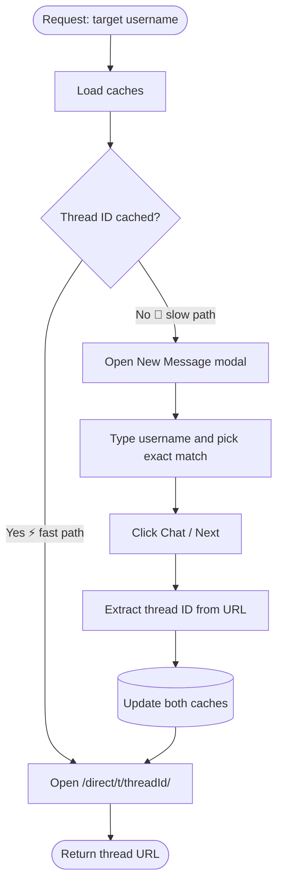

<div align="center">

# 📬 Instagram DM Bridge

**Turn "find that person's DM thread" into a single API call.**

A headless automation service that logs in once, remembers every conversation, and takes you straight to the right Instagram thread, with no clicking around.


[Quick Start](#-quick-start) · [How It Works](#-how-it-works) · [API Reference](#-api-reference) · [Roadmap](#-roadmap) · [Responsible Use](#%EF%B8%8F-responsible-use)

</div>

---

## ✨ Why this exists

Instagram has no friendly public API for direct messages. If you want a bot to message someone, or to pull up an existing conversation, you normally have to log in, search for the person, open the new-message dialog, pick the right result, and hope you land in the right place.

**Instagram DM Bridge does that once, remembers the result, and makes every later lookup instant.**

| Without the Bridge | With the Bridge |
|---|---|
| Search → click → type → select → confirm, every time | One `POST` request |
| Re-discover the same thread repeatedly | Thread IDs cached and reused |
| Fragile, manual UI steps | Fully automated, headless |
| No record of who you've talked to | Searchable local cache of users and threads |

---

## 🚀 Highlights

- 🔐 **Session-based login**: authenticate once and reuse the saved session, so there's no repeated credential entry.
- 👥 **Follower sync**: scrape the list of accounts from the Followers modal and keep it fresh on demand.
- ⚡ **Instant thread lookup**: cached thread IDs open `instagram.com/direct/t/<threadId>/` directly, skipping the search UI entirely.
- 🧠 **Self-healing cache**: if a user has no known thread yet, the Bridge creates it through the New Message flow, captures the ID, and saves it for next time.
- 🌐 **Simple REST API**: four endpoints, JSON in, JSON out, easy to plug into bots, dashboards, or scripts.
- 🪶 **Zero infrastructure**: caching is plain JSON files, so there's no database to install or manage.

---

## 🧭 How It Works

Every request to the Bridge follows the same decision path. The fast path (a cache hit) never touches the search UI at all.



### The three phases

1. **Authenticate**: a stored Instagram session is loaded into headless Chrome, so the browser starts already logged in.
2. **Discover**: the Bridge opens the Followers modal, scrolls through it, and records each username (and display name) it finds.
3. **Resolve**: when you ask for a target user, the Bridge checks its cache. A hit goes straight to the thread. A miss runs the New Message flow once, learns the thread ID, and stores it.

> **Result:** the first lookup for a person is slow (a few UI steps). Every lookup after that is nearly instant.

---

## 🧱 Tech Stack

| Layer | Choice | Why |
|---|---|---|
| Runtime | **Node.js 18+** | Modern, fast, first-class Puppeteer support |
| Browser automation | **Puppeteer** (headless Chrome) | Drives the real Instagram web UI reliably |
| API server | **Express.js** | Minimal and familiar |
| Language | **TypeScript** (compiled to JS) | Type safety around brittle DOM work |
| Storage | **JSON files** | Human-readable, zero setup |

---

## ⚡ Quick Start

**Prerequisites:** Node.js 18 or newer and npm.

```bash
# 1. Get the code
git clone https://github.com/yourname/instagram-dm-bridge.git
cd instagram-dm-bridge

# 2. Install dependencies
npm install

# 3. Compile TypeScript
npm run compile

# 4. Start the server
npm start
```

The API is now live at **`http://localhost:3000`**.

Before you request any threads, authenticate once (see the [`/login`](#post-login) endpoint below). The session is saved, and later runs reuse it automatically.

---

## 🔌 API Reference

All endpoints speak JSON. The payloads below are illustrative, and exact fields may vary by version, so check `docs/api.md` for the authoritative spec.

| Method | Endpoint | Purpose |
|---|---|---|
| `POST` | `/login` | Authenticate and save the session |
| `GET` | `/threads` | List every cached user and thread |
| `POST` | `/select-target` | Resolve a username to a DM thread URL |
| `POST` | `/sync-following` | Refresh the scraped user list and caches |

### `POST /login`
Logs in and persists the session for future runs.

### `GET /threads`
Returns everything the Bridge currently knows about.

```bash
curl http://localhost:3000/threads
```

```json
[
  {
    "username": "jane_doe",
    "displayName": "Jane Doe",
    "threadId": "340282366841710300949128",
    "updatedAt": "2026-10-01T09:42:11.000Z"
  }
]
```

### `POST /select-target`
The main event. Give it a username, and get back a ready-to-use thread URL.

```bash
curl -X POST http://localhost:3000/select-target \
  -H "Content-Type: application/json" \
  -d '{"username": "jane_doe"}'
```

```json
{
  "username": "jane_doe",
  "threadId": "340282366841710300949128",
  "url": "https://www.instagram.com/direct/t/340282366841710300949128/",
  "source": "cache"
}
```

`source` tells you which path was taken: `cache` (fast) or `created` (the Bridge had to start the thread).

### `POST /sync-following`
Re-scrapes the Followers modal and updates both caches. Run it periodically, or whenever you expect new accounts.

---

## 🗂️ Data & Caching

The Bridge keeps two small JSON files in the `server/` directory. You can open and inspect them at any time.

**Quick lookup map**: `username → threadId`
```json
{
  "jane_doe": "340282366841710300949128",
  "new_friend": null
}
```
A `null` value means the user is known, but no thread has been created yet.

**Rich cache**: full records
```json
{
  "username": "jane_doe",
  "displayName": "Jane Doe",
  "threadId": "340282366841710300949128",
  "updatedAt": "2026-10-01T09:42:11.000Z"
}
```

> 💡 Both files are plain text, so they're easy to back up, diff, or reset. Delete them and the next sync rebuilds them.

---

## 🛟 Troubleshooting

| Symptom | Likely cause | Fix |
|---|---|---|
| Redirected to the login page | Session expired | Call `POST /login` again |
| Thread lookup is slow every time | Thread ID is `null` or the cache isn't being saved | Confirm the `server/` directory is writable |
| Wrong user selected in the search | Several similar usernames | Make sure the exact-match selection step is used |
| Selectors suddenly fail | Instagram changed its UI | See `docs/automation.md` and update the selectors |
| Instagram shows a challenge or checkpoint | Unusual activity detected | Log in manually once, slow down your request rate |

---

## 🗺️ Roadmap

- [ ] ✉️ **Send messages**: type into the thread's input and click *Send*
- [ ] 🥷 **Stealth mode**: `puppeteer-extra-plugin-stealth` to reduce bot fingerprints
- [ ] 🗄️ **Real database**: SQLite or MongoDB in place of flat JSON for scale
- [ ] ⏰ **Scheduled syncs**: cron or a built-in scheduler for periodic refreshes
- [ ] 📜 **Conversation history export**
- [ ] 🔔 **Webhooks** for new-thread events

Have an idea? [Open an issue](../../issues).

---

## ⚠️ Responsible Use

This project automates the Instagram web interface. Please keep the following in mind:

- Automated access may violate [Instagram's Terms of Use](https://help.instagram.com/581066165581870), and accounts can be rate-limited, challenged, or suspended as a result.
- Use it only with **your own account** or accounts you are explicitly authorized to operate.
- Do **not** use it for spam, harassment, or bulk unsolicited messaging.
- Treat saved sessions and cache files as **sensitive data**, and never commit them to version control.
- Keep request volumes low and human-like.

You are responsible for how you use this tool. The authors provide it as-is, for learning and legitimate automation.

---

## 📚 Documentation

| Guide | What's inside |
|---|---|
| [`docs/login.md`](docs/login.md) | Generating and storing a session |
| [`docs/api.md`](docs/api.md) | Full API specification |
| [`docs/automation.md`](docs/automation.md) | Puppeteer selectors and timing details |

---

## 🤝 Contributing

Contributions are welcome!

1. **Fork** the repository
2. **Create** a feature branch: `git checkout -b feat/your-feature`
3. **Make** your changes and ensure `npm run lint` passes
4. **Open** a Pull Request with a clear description of what changed and why

---

## 📄 License

Released under the **MIT License**. Use it, modify it, and share it.

<div align="center">

**Happy automating! 🚀**

</div>
